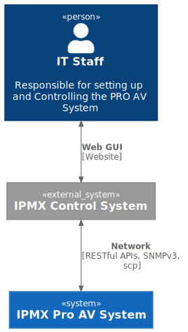
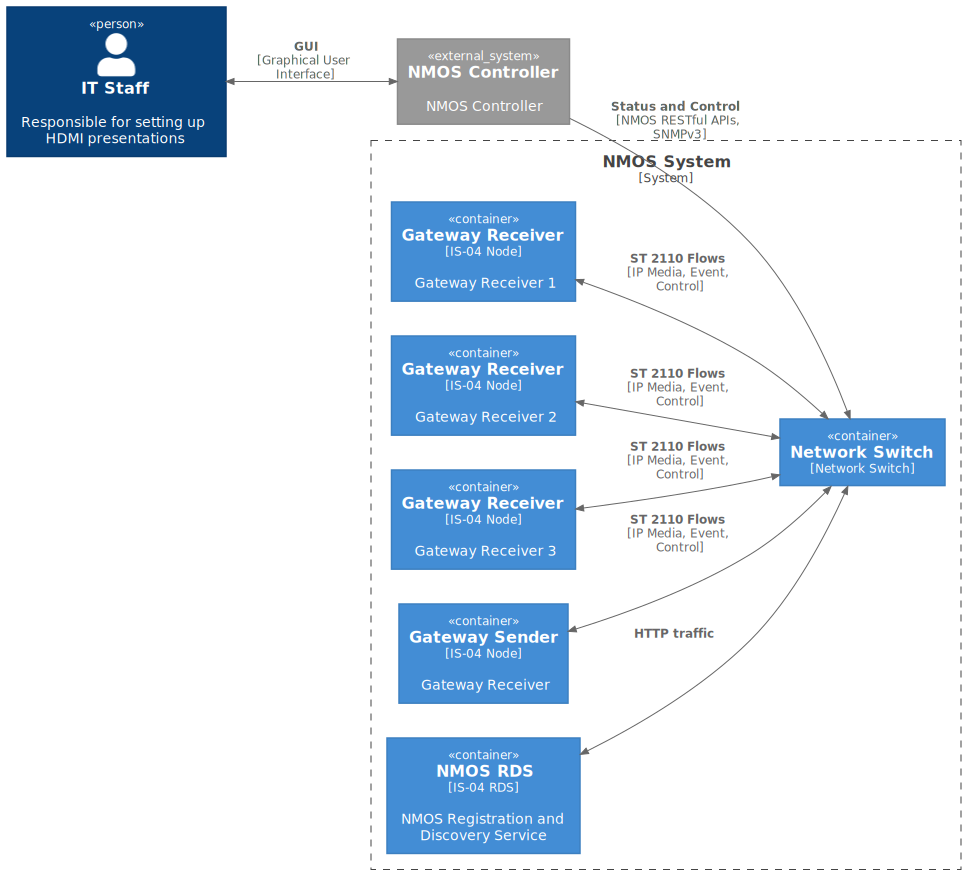
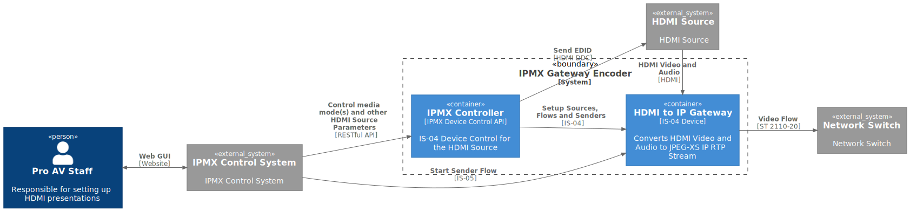
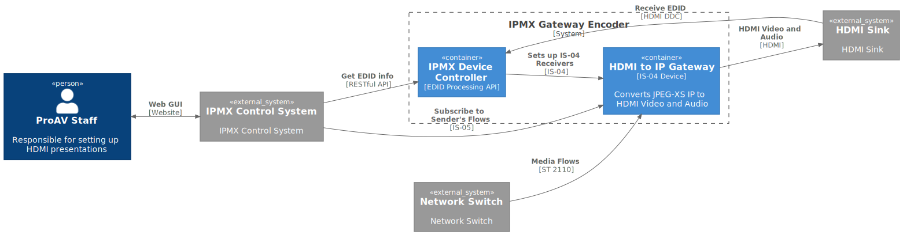
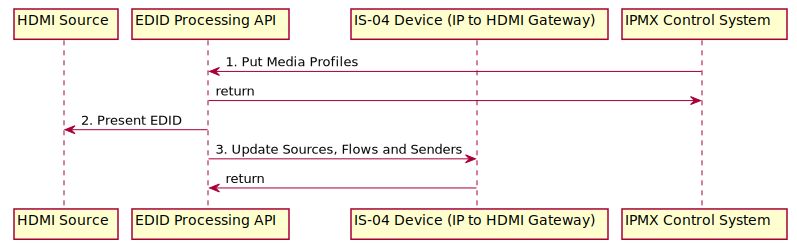
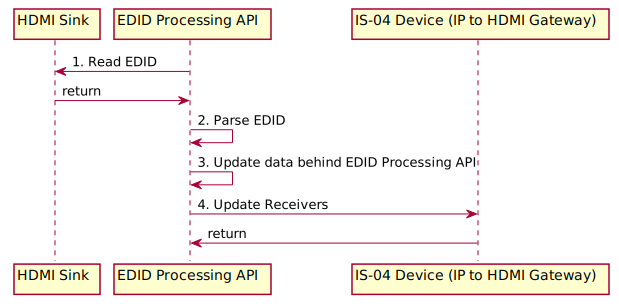
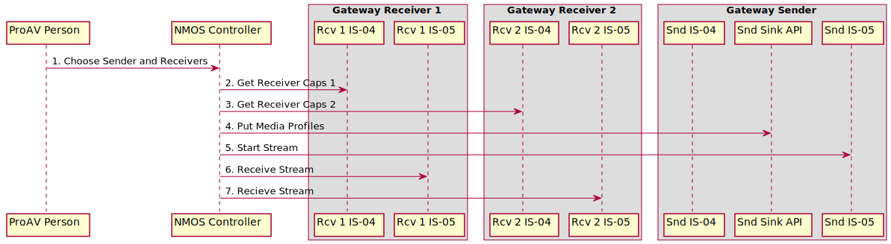
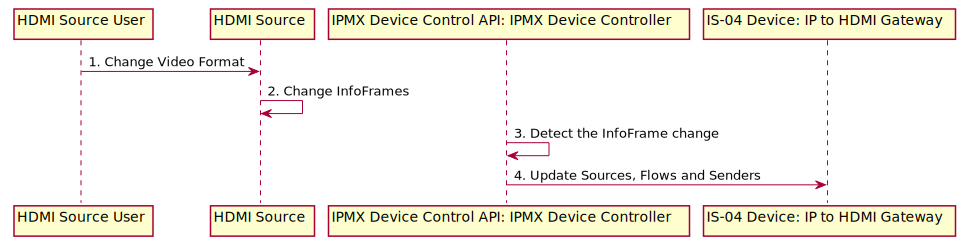
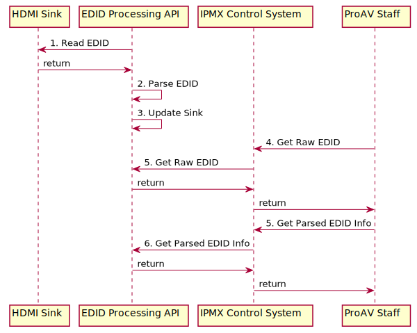

# NMOS Sink Metadata Processing Architecture

## Introduction

This document presents an architecture for Sink Metadata Processing operating in an overall NMOS environment. The document provides a list of user stories followed by static architectural elements. These elements are used as the basis to construct UML sequence diagrams for both EDID processing and related IS-04 discovery and IS-05 connection management. The document provides definitions and network topologies related to the architecture.

## Motivation

ProAV environments differ from broadcast ones. One of ProAV features is focusing on end users which integrate hardware and software on their own with a priori unknown components. Operating in this environment requires automated or semi-automated approaches which signalize about incompatibility between components and configure them to achieve this compatibility if possible. Physical interfaces used in the ProAV industry provide such tools for these purposes as EDID, InfoFrames etc. which requires representing them on the NMOS layer which may be also helpful outside of ProAV environments.

## Definitions

**NMOS System**

A subnet of NMOS-compatible devices.

**NMOS Controller**

An application which operates with NMOS APIs in order to control an NMOS System: discovers Nodes, makes connections etc. It is a wider name of Broadcast Controller.

**Gateway Device**

A device which encapsulates a digital video or/and audio signal (usually, from a physical connection) into IP packets. Conversely, the device may perform the reverse operation for IP packets to a digital signal.

**NMOS Device Controller**

An entity that controls functional block(s) behind an NMOS Device and links this block(s) with NMOS APIs. In the scope of this document its main purpose is providing and maintaining Sink Metadata Processing API.

**Media Profile**

Metadata object which describes a desired format of a Sender. Media Profile consists of separate parameters required to set up an associated Sender and such IS-04 resources behind it as Source and Flow.

## Core User Stories

This architecture addresses the following user stories:

1. As a user with a computer that is connected to an HDMI-IP Gateway (Gateway Sender) that is connected through a network to an IP-HDMI Gateway (Gateway Receiver) plugged into an HDMI monitor with EDID, I would like to be able to turn my computer on and have the best video resolution displayed.

2. As a user with a computer that is connected as above, I'd like to choose a lower video resolution, so that my graphic intensive program plays back more smoothly.

3. As an installer I have a set of pairs of gateway devices that I send out to my staff, when they set up remote presentations to support our hotel guests. I have the gateway devices configured to auto-connect to each other, as soon as they are directly connected via a network cable. The specific monitor or projector (Sink) and Source are unknown, until they are plugged into the gateway devices. I want my gateways to work like they're connected not via a network cable but an HDMI/DisplayPort one.

> **Note:** The intent is that the standard supports a configuration that is able to automatically establish a connection when they are directly connected. This is different from a sending device (with a controller service acting as a Broadcast Controller) that would be configured to connect to a specific receiver when it was detected on the network, which is possible to do today.

4. As an installer, I've added new monitors to the digital signage system that uses multicast IP transport. When I plug them in, they suppose 4K60 as their best, but the rest of the monitors are 1080p. I need the system to play my digital signage content on all of my system's monitors at the best profile supported by all monitors.

5. As a digital signage installer, I need to colour-match the monitors on my video wall. To do this, I need to read the detailed EDID information, which includes the monitor's colour profile, model number and other such information, which I use in my software for calibration.

6. As an installer, I have developed some in-house EDID software that reads the more detailed data from the monitor, such as serial numbers, manufacture date and colour management information. When I make video walls for customers, I use AV over IP hardware to deliver content. I would like to be able to retrieve the EDID binary representation from my monitors into my home-built software, so that I can use that information to adjust the monitors and manage my system.

## NMOS Network Topologies

Each of the user stories applies to one or more network topology which describes the NMOS ecosystem. The following network topologies are identified as relating to particular user stories.

* Peer-to-peer: Two media nodes are directly attached with no network. There are no other devices present.
  * Relates to user stories: 1, 2, 3
* Few-to-few: Very limited number of nodes on a network with no dedicated NMOS Registration and Discovery Service (RDS). Device discovery is handled internally by each device on the network.
  * Relates to user stories: 3, 4, 5, 6
* Many-to-Many: Scalable amount of media nodes within a large network. There are dedicated servers and/or applications for each component such as an NMOS Controller and NMOS RDS.
  * Relates to user stories: 4, 5, 6

## Context Level Diagram

> **Note:** This document will use C4 as the method to capture and develop the architecture. For those unfamiliar with C4, the following introduction is highly recommended: <https://c4model.com/>. The quick 5-minute intro is particularly useful, and the associated video provides more details.

Figure 1 shows one context diagram for an NMOS System. An IT Staff Person responsible for setting up and administering this System uses an external NMOS Controller. It interacts with the System via RESTful APIs, SNMPv3 etc. as described in [JT-NM TR-1001-1](https://www.jt-nm.org/tr-1001-1).

|  |
|:--:|
| *Figure 1. Context Diagram for managing an NMOS System* |

## Container Diagram

Figure 2 shows a Container Level diagram. The diagram shows the technologies used for the containers that make up an NMOS System. Shown are:

* An IS-04 Registration and Discovery Service
* A Gateway Sender that is an IS-04 Node
* Several Gateway Receivers that are also IS-04 Nodes.

|  |
|:--:|
| *Figure 2. Container Diagram for NMOS System* |

## Component Diagrams

### Gateway Sender Component Diagram

Figure 3 shows a component diagram for a Gateway Sender. This diagram illustrates the role of NMOS Device Controller. In addition, this interacts with an HDMI Source by presenting an EDID to it. It also is responsible for the setup of IS-04 resources as shown in the Sequence Diagrams found below.

|  |
|:--:|
| *Figure 3. Component Diagram of a Gateway Sender* |

### Gateway Receiver Component Diagram

Figure 4 shows a component diagram for a Gateway Receiver. As in the Gateway Sender, NMOS Device Controller component is present. For a Gateway Receiver, the NMOS Device Controller is responsible for reading the HDMI Sink's EDID and setting up IS-04 resources including populating IS-04 Receivers with values using [BCP-004-01 Receiver Caps](https://specs.amwa.tv/bcp-004-01).

|  |
|:--:|
| *Figure 4. Component Diagram of a Gateway Receiver* |

## Dynamic Aspects of the Architecture

With the above architecture, we can explore more deeply how we can realize the user stories and use cases using sequence diagrams. The document breaks the user stories into Sink Metadata processing perspectives and IS-04, IS-05 processing perspectives.

### User Story 1 - Automatic Video Mode Negotiation

> 1. As a user with a computer that is connected to an HDMI-IP Gateway (Gateway Sender) that is connected through a network to an IP-HDMI Gateway (Gateway Receiver) plugged into an HDMI monitor with EDID, I would like to be able to turn my computer on and have the best video resolution displayed.

#### Gateway Sender steps for Sink Metadate Processing

Let’s choose an initialization use case for the Gateway Sender. When a Gateway Sender starts up, it should present an EDID to it’s HDMI Sink. A sequence diagram for this use case from the Sink Metadate Processing perspective is shown in Figure 5, with associated steps described more fully in Table 1.

|  |
|:--:|
| *Figure 5. Sequence Diagram for Sink Metadate Processing for Gateway Sender* |

Table 1: Sequence Diagram Steps for Figure 5

| Sequence Step | Description | Notes |
| ---  | ---         | ---         |
| 1.Put Media Profiles | The NMOS Controller puts the Media Profiles of required video and audio formats using Sink Metadata Processing API. | RAML for the endpoints is provided as a separate specification. |
| 2. Return 200 | Sink Metadata Processing API provided by NMOS Device Controller responds with 200 HTTP code. | |
| 3. Present EDID | The NMOS Device Controller sends the EDID to the HDMI Source using HDMI DDC. | |
| 4. Update Sources, Flows and Senders | The NMOS Device Controller updates the IS-04 Sources, Flows and Senders with details of changed media formats. | |

#### Gateway Receiver steps for Sink Metadate Processing

The second use case for the Sink Metadate perspective shows a Gateway Receiver. Figure 6 and Table 2 provide a sequence diagram and associated details for this use case.

|  |
|:--:|
| *Figure 6. Sequence Diagram for Sink Metadate Processing for Gateway Receiver* |

Table 2: Sequence Diagram Steps for Figure 6

| Sequence Step | Description | Notes |
| ---  | ---         | ---         |
| 1. Request EDID | NMOS Device Controller reads EDID of an HDMI Sink. | |
| 2. Give EDID | HDMI Sink gives EDID. | |
| 3. Update Sink Metadata Processing API content | The NMOS Device Controller updates Receiver with a new Sink and attaches its binary EDID. | |
| 4. Update Receiver and Receiver Capabilities | The NMOS Device Controller updates the IS-04 Receivers with new Receiver Caps. | |

#### NMOS High-Level Perspective

Once a Gateway Sender and a Gateway Receiver have come online and processed the EDID information as shown in Figures 5 and 6, the system is ready to process IS-05 connections.
Figure 7 shows a sequence diagram for setting up a connection between a Gateway Sender and two Gateway Receivers. In this illustration the IT person requests via an NMOS Controller that an output stream from the Gateway Sender is sent to two Gateway Receivers. Table 3 describes the steps with details.

|  |
|:--:|
| *Figure 7. Sequence Diagram for user story 1 from NMOS high-level perspective* |

Table 3: Details for Sequence Diagram Steps for Figure 6

| Sequence Step | Description | Notes |
| ---  | ---         | ---         |
| 1. Choose Sender and Receivers | The IT person interacts with the NMOS Controller to choose a set of receivers for a sender. | |
| 2. Get Receiver Caps 1 | The NMOS Controller retrieves the Receiver Caps from the Gateway Receiver 1. | Population of the Receiver Caps has been done as part of EDID processing shown in Figure 6. |
| 3. Get Receiver Caps 2 | The NMOS Controller retrieves the Receiver Caps from the Gateway Receiver 2. | |
| 4. Put Media Profiles | Based on the Receiver Caps Media Profile is created with the best video format available (as required by the user story) or Media Profiles which all the Receivers are capable of consuming. | Create info needed for the Gateway Sender to update IS-04 resources. |
| 5. Start Stream | The standard IS-05 mechanism is used to start the stream sending on the Gateway Sender | |
| 6-7. Receive Stream | IS-05 is used to make the connection to Gateway Receivers 1 and 2 | |

### User Story 2 - User Configured Graphics Mode

The section above covered user stories 1, 3, and 4. User story 2 requires an additional step related to changing HDMI Source format on the fly:

> 2. As a user with a computer that is connected as above, I'd like to choose a lower video resolution, so that my graphic intensive program plays back more smoothly.

Figure 8 shows the EDID processing required for this user story. The NMOS Device Controller is responsible for detecting a change in the video format sent by the HDMI Source by monitoring changes to HDMI InfoFrames. The NMOS Device Controller can either poll the changes in HDMI InfoFrames or cue off of an HDMI Hot Plug Detect event from the HDMI Source.

|  |
|:--:|
| *Figure 8. Sequence Diagram for User Configured Graphics Mode* |

Table 4: Details for User Configured Graphics Mode

| Sequence Step | Description | Notes |
| ---  | ---         | ---         |
| 1. Send InfoFrames | The HDMI Source changes it’s video mode in response to a user changing video format. | |
| 2. Update Sources, Flows and Senders | The NMOS Device Controller updates the Sources, Flows and Senders resources of IS-04 based on the new video format. | |

#### NMOS IS-04 IS-05 Perspective

From the perspective of setting up an IS-05 connection once the sequences shown in Figure 8 completes the identical steps as shown in Figure 7 apply to realize User-Story 2.

### User Stories 5 and 6 - Detailed EDID Information

User stories 5 and 6 will be treated together since both can be realized using the same mechanism. The user stories are:

> 5. As a digital signage installer, I need to colour-match the monitors on my video wall. To do this, I need to read the detailed EDID information, which includes the monitor's colour profile, model number and other such information, which I use in my software for calibration.

> 6. As an installer, I have developed some in-house EDID software that reads the more detailed data from the monitor, such as serial numbers, manufacture date and colour management information. When I make video walls for customers, I use AV over IP hardware to deliver content. I would like to be able to retrieve the EDID binary representation from my monitors into my home-built software, so that I can use that information to adjust the monitors and manage my system.

Since detailed information that is provided by EDID is applicable only to an Gateway Receiver a single use case is described for retrieving EDID information from an Gateway Receiver.

Figure 10 shows a sequence diagram based on Figure 4 for retrieving the information required by user stories 5 and 6. Table 5 provides details on relevant steps.

|  |
|:--:|
| *Figure 9. Sequence Diagram for user Retrieving Raw and Parsed EDID Information* |

Table 5: Sequence Diagram Steps for Figure 10

| Sequence Step | Description | Notes |
| ---  | ---         | ---         |
| 1. Request EDID | At startup or on change (Hot Plug Detect) NMOS Device Controller requests the EDID of the HDMI Sink. | |
| 2. Give EDID | HDMI Sink gives EDID. | |
| 3. Update Sink Metadata Processing API content | The NMOS Device Controller updates Receiver with a new Sink and attaches its binary EDID. | |
| 4. Get EDID binary | A user requests the EDID binary of the HDMI Sink associated with Receiver. | |
| 5. Request EDID binary | The NMOS Controller requests the EDID binary from Sink Metadata Processing API. | |
| 6. Return EDID binary | Sink Metadata Processing API returns EDID binary to NMOS Controller. | |
| 7. Return EDID binary | NMOS Controller returns EDID binary to the user. | |
| 8. Get Sink | The user requests information about HDMI Sink from NMOS Controller. | |
| 9. Request Sink | The NMOS Controller requests the Sink from Sink Metadata Processing API. | |
| 10. Return EDID binary | Sink Metadata Processing API returns Sink to NMOS Controller. | |
| 11. Return EDID binary | NMOS Controller returns Sink to the user. | |

## Conclusions

This document has described an Architecture that covers Sink Metadata Processing user stories provided by phase I of the NMOS Sink Metadata Processing activity. Overall design goals to minimize changes to the existing architecture result in an architecture that adds an additional API. Details of the architecture have been provided using C4 diagrams for Context, Container, and Component Diagrams along with UML Sequence diagrams to illustrate realization of the user stories using the proposed architecture.
