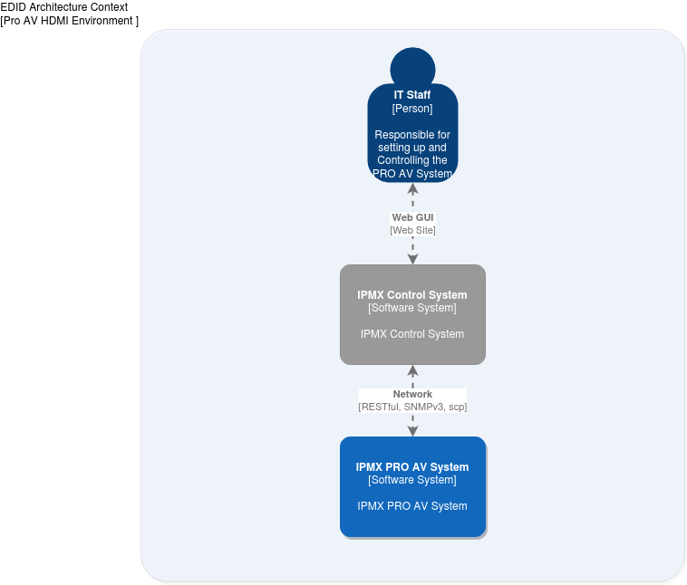
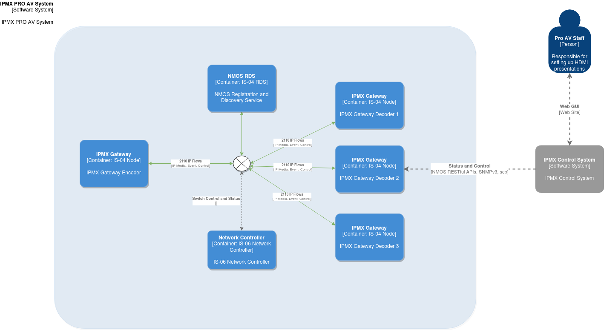
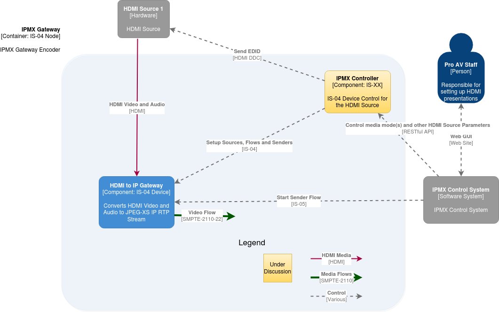
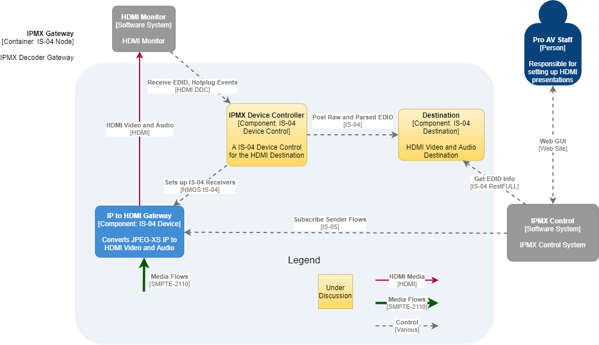
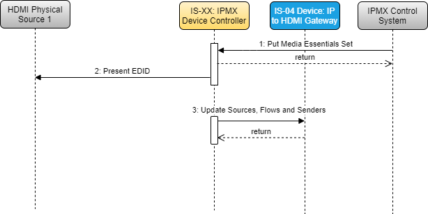
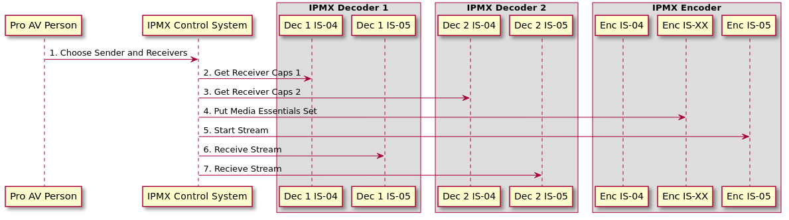
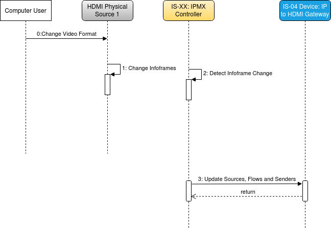
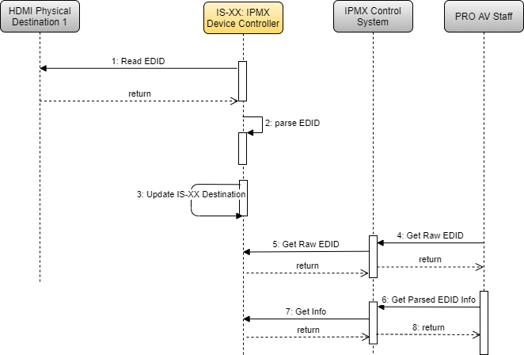

# NMOS EDID Connection Management Architecture

## Introduction

This document presents an architecture for EDID Connection Management operating in an overall NMOS environment.  The document provides a list of User-Stories followed by static architectural elements.  These elements are used as the basis to construct UML sequence diagrams for both EDID processing and related IS-04 discovery and IS-05  connection management.  The document provides definitions and network topologies related to the architecture. 

## Core User Stories

This architecture addresses the following User Stories:

1. As a user with a computer that is connected to an HDMI-IPMX gateway (sender) that is connected through a network to an IPMX-HDMI gateway (receiver) plugged into an HDMI monitor with EDID, I would like to be able to plug my computer in and have the best video resolution displayed.

2. As a user with a computer that is connected as above, I'd like to change the resolution of my display to support graphics mode that is lower resolution, so that my graphic intensive program plays back more smoothly.

3. As a pro AV installer I have a set of gateway devices that I send out to my staff, when they set up remote presentations to support our hotel guests. I have the gateway devices configured to auto-connect to each other, as soon as they turn on. The specific monitor or projector (sink) and source are unknown, until they are plugged into the gateway devices. I want my staff to be able to plug a network cable directly into each device (sender and receiver). I have configured these devices to automatically connect to each other when they are directly connected via a network cable... Basically, I want my gateway to work like an HDMI/DisplayPort cable would.

> **Note:** The intent is that the standard supports a configuration that is able to automatically establish a connection when they are directly connected. This is different from a Sending device (with a controller service acting as a Broadcast Controller) that would be configured to connect to a specific receiver when it was detected on the network, which is possible to do today.

4. As a Pro AV installer, I've added new monitors to the digital signage system that uses IPMX to multicast transport video to my displays. When I plug them in, they negotiate to 4K60, but the rest of the monitors are 1080p. I need the system to play my digital signage content on all of my system's monitors at the best profile supported by all monitors.

5. As a Pro AV digital signage installer, I need to colour-match the monitors on my video wall. To do this, I need to read the detailed EDID information, which includes the monitor's colour profile, model number and other such information, which I use in my software for calibration.

6. As a Pro AV installer, I have developed some in house EDID software that reads the more detailed data from the monitor, such serial numbers, manufacture date and colour management information. When I make video walls for customers, I use IPMX AV over IP hardware to deliver content. I would like to be able to retrieve the EDID binary representation from my monitors into my home-built software, so that I can use that information to adjust the monitors and manage my system.

## Definitions

**IPMX**

IPMX (Internet Protocol Media Experience) is a proposed set of open standards and specifications to enable the carriage of compressed and uncompressed video, audio and data over IP networks for the ProAV market. It includes provisions for control, copy protection, connection management and security.

**IPMX Control System**

An application which controls IPMX-compatible NMOS Nodes: discovers them, makes connections etc. An analogue of Broadcast Controller for Pro AV use cases.

**IPMX Controller**

An IS-04 Device Control. It provides an HTTP RESTful API (IS-XX) which provides information about and control of an IPMX-driven NMOS Device.

**Media Essentials**

Media description which describes a format acceptable for all Receivers implied to be a part of a further connection. Media Essentials consist of separate parameters needed to set up transmitting hardware and Source, Flow and Sender IS-04 resources.  This resource is similar to Media Metadata and may merge into Media Metadata as further work defines details of the resource. 

**Media Essentials Set**

Set of multiple Media Essentials which are all acceptable for all Receivers implied to be a part of a further connection. Note that this set may merge into a Media Metadata set in further work.

## NMOS Network Topologies

Each of the user stories applies to one or more network topology which describes the NMOS ecosystem.  The following network topologies are identified as relating to particular User-Stories.

* Peer-to-peer: Two media nodes are directly attached with no network. There are no other devices present.
  * Relates to User-Stories: 1, 2, 3
* Few-to-few: Very limited number of nodes on a network with no dedicated NMOS Registration and Discovery Server (RDS). Device discovery is handled internally by each device on the network.
  * Relates to User-Stories: 3, 4, 5, 6
* Many-to-Many: Scalable amount of media nodes within a large network. There are dedicated servers and/or applications for each component such as an IPMX NMOS Controller and NMOS RDS.
  * Relates to User Stories: 4, 5, 6

## Context Level Diagram

> **Note:** This document will use C4 as the method to capture and develop the architecture.  For those unfamiliar with C4, the following introduction is highly recommended: <https://c4model.com/>.  The quick 5-minute intro is particularly useful, and the associated video provides more details.

Figure 1 shows one context diagram  for an IPMX HDMI Gateway System. An IT Staff Person responsible for setting up and administering an IPMX PRO AV System uses an external Control System (CS) . This CS interacts with the IPMX System via RESTful, SNMPV3, ssh, etc as described in [JT-NM TR-1001-1](https://www.jt-nm.org/documents/JT-NM_TR-1001-1:2018_v1.0.pdf). Note that the architecture presented here does not require a centralized controller (i.e. all NMOS Network Topologies shown above are supported).

|  |
|:--:|
| *Figure 1. Context Diagram for EDID Connection Management with Central Control System* |

## Container Diagram

Figure 2 shows a Container Level diagram. The diagram shows the technologies used for the containers that makeup an IPMX PRO AV System. Shown are:

* An IS-04 Registration and Discover Service
* An IS-06 Network Controller
* An IPMX Gateway Encoder that is an IS-04 Node
* Several IPMX Gateway Decoders that are also IS-04 Nodes.

|  |
|:--:|
| *Figure 2. Container Diagram for IPMX PRO AV System* |

## Component Diagrams

### IPMX Gateway Encoder Component Diagram

Figure 3 shows a component diagram for an IPMX Gateway Encoder. This diagram illustrates the role of a new architectural component shown in tan. This new component is an IPMX Controller that provides a proposed IS-XX RESTful API to support the User-Stories described above. In addition to providing the IS-XX RESTful API, the IPMX Controller interacts with an HDMI Source by presenting an EDID. It also is responsible for the setup of IS-04 resources as shown in the Sequence Diagrams found below. The IPMX Controller is analogous to the IS-04 Device Control used for IS-05.

|  |
|:--:|
| *Figure 3. Component Diagram of an IPMX Gateway Encoder* |

### IPMX Gateway Decoder Component Diagram

Figure 4 shows a component diagram for an IPMX Gateway Decoder.  As in the IPMX Gateway Encoder, a new IPMX Controller component is present.  For an IPMX Gateway Decoder,  the IPMX Controller is responsible for reading the HDMI Monitor’s EDID, setting up IS-04 Decoder resources including populating the IS-04 receivers with values using the latest IS-04 Receiver Caps syntax. In addition, the IPMX Controller provides an IS-XX RESTful API to external components responsable for overall control of the Node.

|  |
|:--:|
| *Figure 4. Component Diagram of an IPMX Gateway Decoder* |

## Dynamic Aspects of the Architecture

With the above architecture, we can explore more deeply how we can realize the User Stories and Use-Cases using sequence diagrams.  The document breaks the User-Stories into EDID processing perspectives and IS-04, IS-05 processing perspectives.

### User Story 1 - Automatic Video Mode Negotiation

> User-Story 1: As a user with a computer that is connected to an HDMI-IPMX gateway (sender) that is connected through a network to an IPMX-HDMI gateway (receiver) plugged into an HDMI monitor with EDID, I would like to be able to plug my computer in and have the best video resolution displayed.

#### EDID Processing Perspective Encoder Use-Case

Let’s choose an initialization Use-Case for the IPMX Gateway Encoder.  When an IPMX Gateway Encoder starts up, it should present an EDID to it’s HDMI monitor.  Referring to Figure 1, we can create a sequence diagram for this use-case from the EDID processing perspective, as shown in Figure 5, with associated steps described more fully in Table 1.

|  |
|:--:|
| *Figure 5. Sequence Diagram for IPMX Gateway Encoder Setup using EDID* |

Table 1: Sequence Diagram Steps for Figure 5

| Sequence Step | Description | Notes |
| ---  | ---         | ---         |
| 1: Put Media Essentials Set | The IPMX Control System puts the media essentials required video and audio formats using a IS-XX endpoint for media essentials. | RAML for the endpoints is provided as a separate document including specifications for Work-in-Progess elements such as media_essentions_set. |
| 2: Present EDID | The IPMX Controller sends the EDID information to the HDMI Physical Source using the device’s DDC. | |
| 3: Update Sources, Flows and Senders | The IPMX Controller updates the IS-04 Sources, Flows and Senders with information from the Media Essentials Set. | |

#### EDID Processing Perspective Decoder Use-Case

The second use-case for the EDID perspective shows an IPMX Gateway Decoder. Figure 6 and Table 2 provide a sequence diagram and associated details for this use-case.

|  |
|:--:|
| *Figure 6. Sequence Diagram for IPMX Gateway Decoder Setup using EDID* |

Table 2: Sequence Diagram Steps for Figure 6

| Sequence Step | Description | Notes |
| ---  | ---         | ---         |
| 1: Read EDID | The IPMX Control System reads the EDID from the HDMI Physical Destination. | |
| 2: Parse EDID | The HDMI Controller parses the raw EDID file. | During this internal processing, various required JSONs are composed based on schemas for IS-04 receivers caps. |
| 3: Update IS-XX Destination | The IPMX Controller updates the IS-XX Destination resource using EDID info | The destination resource associated with the IPMX Controller’s IS-XX API includes such information as Manufacturer, Serial Id, etc for the HDMI Monitor. Details provided in a WIP schema area. |
| 4: Update Receivers | The IPMX Controller updates the IS-04 Receivers with extended receiver caps. | |

##### NMOS IS-04 IS-05 Perspective

Once the IPMX Encoder and Decoder Gateways have come online and processed the EDID information as shown in Figures 5 and 6 the system is ready to process IS-05 connections.
Figure 7 shows a sequence diagram for setting up a connection between an IPMX Encoder and two IPMX Decoders. In this illustration the Pro AV Person requests via an IPMX Control System that an output stream from the IPMX Encoder is sent to two IPMX Decoders. Table 3 describes the steps with details.

|  |
|:--:|
| *Figure 7. Sequence Diagram for User-Story 1 from NMOS Perspective* |

Table 3: Details for Sequence Diagram Steps for Figure 6
| Sequence Step | Description | Notes |
| ---  | ---         | ---         |
| 1: Choose Sender and Receiver | The PRO AV Person interacts with the IPMX Control System to choose a set of receivers for a sender. | |
| 2: Get receiver caps 1 | The IPMX Control system retrieves the receiver caps from the IPMX Decoder 1. | The receiver caps makes use of the extended receiver caps that describe items such as ranges.  Population of the receiver caps has been done as part of EDID processing shown in Figure 6 |
| 3: Get receiver caps 2 | The IPMX Control system retrieves the receiver caps from the IPMX Decoder 2. | |
| 4: Put Media Essentials Set | Based on the receiver capabilities a Media Essentials Set  is created with the best video format available (as required by the User-Story) | Create info needed for the encoder to create IS-04 resources. |
| 5: Start Stream | The standard IS-05 mechanism is used to start the stream sending on the IPMX Encoder | |
| 6-7: Receive Stream | IS-05 is used to make the connection to IPMX Decoders 1 and 2 | |

### User Story 2 - User Configured Graphics Mode

The section above covered User Stories 1, 3, and 4. User Story 2 requires an additional step related to HDMI Hot Plug Detect:

> User Story 2. As a user with a computer that is connected as above, I'd like to change the resolution of my display to support graphics mode that is lower resolution, so that my graphic intensive program plays back more smoothly.

Figure 8 shows the EDID processing required for this User Story. The IPMX Controller is responsible for detecting a change in the video format sent by the HDMI source by monitoring changes to HDMI infoframes sent by the source. The IPMX Controller can either poll the changes in HDMI infoframes or cue off of an HDMI Hot-plug-detect event from the HDMI Source.

|  |
|:--:|
| *Figure 8. Sequence Diagram for User Configured Graphics Mode* |

Table 4: Details for User Configured Graphics Mode

| Sequence Step | Description | Notes |
| ---  | ---         | ---         |
| 0: Change Video Format | The computer user changes their video format | Note this would be done using the standard gui for control of an output monitor from Windows, Linux etc. |
| 1: Change Infoframes | The HDMI Physical source changes it’s video mode in response to a user changing it’s video format. | |
| 2: Detect InfoFrame Change | The IPMX Controller is responsible for detecting the change in inforframes | Implementation of this detection is vendor specific but typically handled via a HPD interrupt or polling of the HDMI driver for the device’s HDMI input port. |
| 3: Update Sources, Flows and Senders | The IPMX Controller updates the Sources, Flows and Senders resources of IS-04 based on the new Video Format. | |

#### NMOS IS-04 IS-05 Perspective

From the perspective of setting up an IS-05 connection once the sequences shown in Figure 8 completes the identical steps as shown in Figure 7 apply to realize User-Story 2.

### User Stories 5 and 6 - Detailed EDID Information

User stories 5 and 6 will be treated together since both can be realized using the same mechanism.  The user-stories are:

> 5. As a Pro AV digital signage installer, I need to colour-match the monitors on my video wall. To do this, I need to read the detailed EDID information, which includes the monitor's colour profile, model number and other such information, which I use in my software for calibration.

> 6. As a Pro AV installer, I have developed some in house EDID software that reads the more detailed data from the monitor, such serial numbers, manufacture date and colour management information. When I make video walls for customers, I use IPMX AV over IP hardware to deliver content. I would like to be able to retrieve the EDID binary representation from my monitors into my home-built software, so that I can use that information to adjust the monitors and manage my system.

Since detailed information that is provided by EDID is applicable only an IPMX Decoder a single Use-Case is described for retrieving EDID information from an IPMX Decoder.

Figure 10 shows a sequence diagram based on Figure 4 for retrieving the information required by User-Stories 5 and 6. Table 5 provides details on relevant steps.

|  |
|:--:|
| *Figure 9. Sequence Diagram for Pro AV User Retrieving Raw and Parsed EDID Information* |

Table 5: Sequence Diagram Steps for Figure 10

| Sequence Step | Description | Notes |
| ---  | ---         | ---         |
| 1: Read EDID | At startup or on change (Hot Plug Detect)  the HDMI Controller reads the monitor’s EDID. | |
| 2: Parse EDID | The EDID is parsed and put into a JSON Format. | |
| 3: Update IS-XX Destination | The IS-XX Destination is updated. | |
| 4: Get Raw EDID | A PRO AV User requests the raw EDID for the HDMI Physical Device. | |
| 5: Get Raw EDID | The IPMX Control System requests the raw EDID from the HDMI Controller. | |
| 6: Get Parsed EDID Info | PRO AV Staff requests information from the EDID described in User-Story 6). | |
| 7: Get Info | The IPMX Control System performs a Get on Destinations information resource. | This information is provided in a JSON Format. |
| 8: return | The information described in User-Story 6 is presented to the PRO-AV User. | |

## Conclusions

This document has described an Architecture that covers EDID Connection Management User-Stories provided by phase one of the NMOS EDID Connection management activity.  Overall design goals to minimize changes to the existing architecture result in an architecture that adds an additional IS-04 Control point and recommendations for an API provided by that Control point.  Details of the architecture have been provided using C4 diagrams for Context, Container, and Component Diagrams along with UML Sequence diagrams to illustrate realization of the User-Stories using the proposed architecture.
